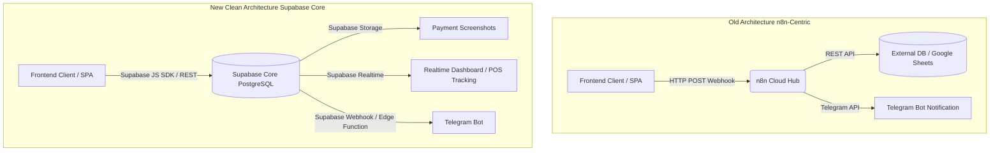

# 🏛️ التقرير المعماري الشامل: التحول الاستراتيجي من n8n إلى Supabase Core وتطبيق Clean Architecture

---

## 1. الملخص التنفيذي (Executive Summary)
كان النظام القديم يعتمد على **n8n** كطبقة وسيطة (Middleware & Data Hub) لاستقبال طلبات الويب (Webhooks) ومعالجة البيانات، ثم توجيهها إلى جداول جوجل أو قواعد بيانات خارجية. 
أدى هذا الاعتماد إلى:
- زيادة زمن الاستجابة (Latency) بسبب كثرة التنقلات (Hops).
- تعريض النظام لمخاطر الأمان نتيجة وجود مسارات Webhooks مفتوحة ومفاتيح وصول في ملفات الواجهة (مثل `api.js`).
- صعوبة التوسع والصيانة وتتبع الأخطاء في الوقت الفعلي.

**الهدف الاستراتيجي:** تم إعادة تصميم وبناء معمارية النظام بالكامل ليصبح **Supabase** هو المحرك الأساسي (Backend Core)، حيث يتولى إدارة قواعد البيانات (PostgreSQL)، التوثيق (Auth)، التخزين السحابي (Storage)، والتحديثات اللحظية (Realtime). تم تطبيق مبادئ **Clean Architecture** لفصل الواجهات عن منطق الأعمال والخدمات، مع حماية كاملة للمفاتيح والإعدادات.

---

## 2. تحليل النظام وتدفق البيانات (System Analysis & Data Flow)

### 🔄 مقارنة مسار البيانات: قبل وبعد التحول المعماري



### 📊 جدول المقارنة المعمارية (Architectural Mapping Matrix)

| الوظيفة في النظام القديم (n8n) | البديل المعماري الحديث (Supabase Core) | الفوائد التقنية والأمان |
| :--- | :--- | :--- |
| **استقبال الطلبات (Orders)** | الإدراج المباشر في جدول `orders` و`order_items` عبر `supabase.from('orders').insert(...)` | سرعة استجابة فائقة (أقل من 50ms) وضمان تكامل البيانات (ACID Compliance). |
| **إدارة المنيو والأصناف** | جلب البيانات من جدول `menu_items` و`categories` مع نظام التخزين المحلي كـ Fallback | استعلامات مهيكلة وسريعة مع إمكانية الفلترة والبحث المتقدم. |
| **رفع صور الإيصالات (Screenshots)** | إرسال الصورة كـ Base64 لـ n8n | تحويل الصورة إلى Blob ورفعها مباشرة إلى **Supabase Storage** (Bucket: `payment-screenshots`) وتخزين الرابط الآمن. |
| **الحجوزات (Reservations)** | Webhook مخصص لحجوزات الطاولات | جدول `reservations` مع التحقق من صحة المواعيد ورفع إيصالات العربون. |
| **الشكاوى والمقترحات** | إرسال عبر Webhook | جدول `feedback` محمي بصلاحيات RLS تتيح الإدراج المجهول (Anonymous Insert). |
| **التنبيهات اللحظية (Notifications)**| Polling أو n8n Webhook | اشتراك مباشر عبر **Supabase Realtime** (`postgres_changes`) لتحديث شاشات المطبخ وتتبع الطيارين. |

---

## 3. هيكلية المشروع النظ clean (Production-Ready Clean Architecture Structure)

تم تنظيم المشروع بدقة وفق الطبقات المعمارية النظيفة لضمان استقلالية كل جزء وسهولة الصيانة:

```
├── .env                  <-- متغيرات البيئة الآمنة (ممنوع رفعها لـ Git)
├── .gitignore            <-- حماية الملفات الحساسة (api.js, config.js, .env)
├── src/
│   ├── core/             <-- النواة والإعدادات الأساسية
│   │   ├── config/       <-- `index.js` (تصدير الإعدادات من `import.meta.env`)
│   │   ├── constants/    <-- الثوابت (المناطق، الإحداثيات، النطاقات)
│   │   └── utils/        <-- دوال مساعدة (تنسيق العملات، الحسابات، معالجة الصور)
│   │
│   ├── services/         <-- طبقة الخدمات (Services Layer - API Calls)
│   │   ├── supabase/     <-- `supabaseClient.js` (تهيئة اتصال Supabase)
│   │   └── api/          <-- الخدمات المنفصلة (menuService, orderService, reservationService, feedbackService)
│   │
│   ├── hooks/            <-- إدارة الحالة المخصصة (State Management / Hooks)
│   │   └── useCart.js    <-- إدارة سلة المشتريات وتفاصيل الطلب والموقع
│   │
│   ├── features/         <-- المكونات الوظيفية (Feature-based Modular UI)
│   │   ├── cart/         <-- مكونات السلة (CartDrawer, StickyCartBar)
│   │   ├── checkout/     <-- مكونات الدفع ومراجعة الطلب (OrderSummary, ProgressSteps)
│   │   ├── reservation/  <-- نظام الحجوزات (ReservationModal)
│   │   └── feedback/     <-- نظام الشكاوى (FeedbackModal)
│   │
│   ├── pages/            <-- صفحات التطبيق الأساسية (Pages)
│   │   ├── MenuPage.jsx  <-- صفحة المنيو والأصناف
│   │   ├── ReviewPage.jsx<-- مراجعة السلة واختيار نوع الطلب
│   │   ├── CustomerPage.jsx <-- إدخال بيانات العميل وتحديد الموقع (GPS / Map)
│   │   └── PaymentPage.jsx <-- حساب الإجمالي، بيانات التحويل، ورفع الإيصال
│   │
│   └── App.jsx           <-- نقطة التجميع والتوجيه (Routing)
```

---

## 4. إنجازات الأمان والتنظيف البرمجي (Security & Code Cleanup Achievements)

### 🔒 1. إدارة الإعدادات وحماية الأسرار (Environment & Secrets Management)
- **إزالة المفاتيح الصلبة (No Hardcoded Credentials):** تم تنظيف جميع الملفات من روابط Webhooks وعناوين الخوادم والمفاتيح.
- **تكوين `.gitignore` الصارم:** تم التأكد من إدراج `.env`، `api.js`، `config.js`، `node_modules/`، و`dist/` لضمان عدم تسريب أي أسرار للمستودع.
- **إهلاك الملف القديم (`api.js` في الجذر):** تم تحويل ملف `api.js` القديم في جذر المشروع إلى ملف يوجه المطورين إلى `src/services/api/index.js` بدون أي محتوى سري.

### 🚀 2. تحييد n8n واعتماد Supabase الكامل
- **تنظيف صفحة الدفع (`PaymentPage.jsx`):** تم حذف الكود الخاص بالاتصال بـ `n8n.cloud` بالكامل، والاعتماد الفوري والمباشر على `await orderService.submitOrder(orderData)`.
- **تنظيف مكون السلة (`CartDrawer.jsx`):** تم تحديث الدالة `handleCreateOrder` واستبدال رابط الـ Webhook الصلب بدعوة قياسية لخدمة `orderService.submitOrder`، مما يضمن اتساق البيانات وخضوع جميع الطلبات لنفس طبقة التحقق.

### 📦 3. تحسين تخزين البيانات وتقليل التكرار (Storage Optimization)
- في `orderService.js`، يتم إنشاء نسخة مضغوطة (`compactPayload`) لتخزينها في عمود `raw_payload` كنسخة احتياطية، بينما يتم توزيع البيانات المهيكلة على الأعمدة المخصصة (الاسم، الهاتف، العنوان، الإحداثيات، الإجمالي، ورابط الإيصال).

---

## 5. التوصيات المستقبلية (Future Architecture Recommendations)

1. **Supabase Realtime Dashboard:** يمكن إنشاء لوحة تحكم (Dashboard) لإدارة المطعم تعتمد على `supabase.channel('custom-insert-channel')` لمراقبة الطلبات والحجوزات فور وصولها مع إصدار تنبيه صوتي للمطبخ.
2. **Supabase Edge Functions:** في حال الحاجة لإرسال إشعارات مخصصة عبر تليجرام أو واتساب عند تغير حالة الطلب (من `pending` إلى `preparing` أو `delivered`)، يوصى بإنشاء Edge Function تعمل عند وقوع حدث (Database Webhook / Trigger).
3. **التخزين المؤقت المتقدم (Advanced Caching):** دمج React Query أو SWR في واجهة التطبيق لإدارة التخزين المؤقت للأصناف والحالات اللحظية بمرونة أعلى.
